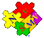
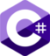

Hi, I'm Bjarke. This is my github page which I don't use too often. I enjoy coding in my professional life, and have throughout my career and studies played with many programming languages. Here's a cool timeline of when I wrote my first program in the following languages.

PS: I define a programming language to be a turing complete language :sunglasses:
<table>
<th align="center" valign="top">

  <h3>2007</h3>
  
  <h3>2009</h3>
  
  <h3>2012</h3>
  
  <h3>2013</h3>
  
</th>
<th align="center" valign="top">

  <h3>2014</h3>
  
  <h3>2015</h3>
  
  <h3>2016</h3>
  
  <h3>2017</h3>
  
</th>
<th align="center" valign="top">

  <h3>2018</h3>
  
  <h3>2019</h3>
  
  <h3>2020</h3>
  
</th>
</table>
