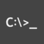
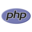

Hi, I'm Bjarke. This is my github page which I don't use too often. I enjoy coding in my professional life, and have throughout my career and studies played with many programming languages. Below you can see a timeline for when I wrote my first program in the following languages.

PS: I define a programming language to be a turing complete language :sunglasses:

  **2007:** &emsp;
  **2009:** &emsp;
  **2012:** &emsp;
  **2013:** &emsp;
  
  **2014:** &emsp;
  **2015:** &emsp;
  
  **2016:** &emsp;
  **2017:** &emsp;
  **2018:** &emsp;
  **2019:** &emsp;
  
  **2020:** &emsp;
  **2024:** 

My dad bought me a Windows 95 when i was just 3 years old. I have been told that I loved playing DOOM, and that my weapon of choice was the chainsaw :grin:

Around 6th grade i had my first encounter with the Windows Command Prompt and was fascinated how it was possible to make the machine do stuff, by simply typing various commands.

My joy for computers and math eventually pushed me to pursue my masters degree in Computer Science, and since then I've always found it fun to work with different aspects of the programming world.

Currently i like to play around a tech stack of Python/C#, SQL/NoSQL, Docker, and AWS/Azure.
